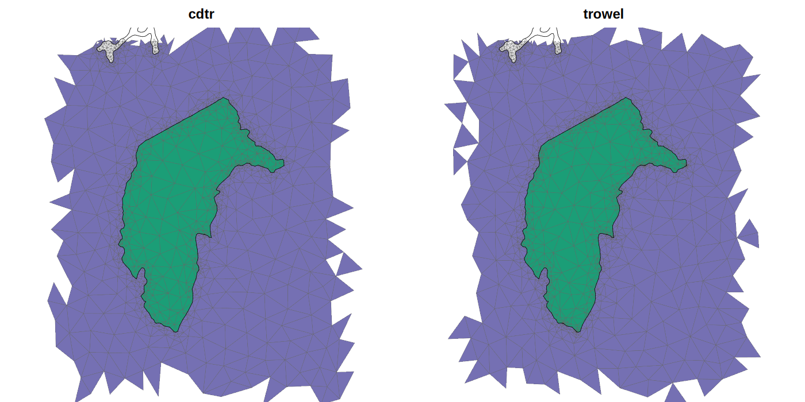
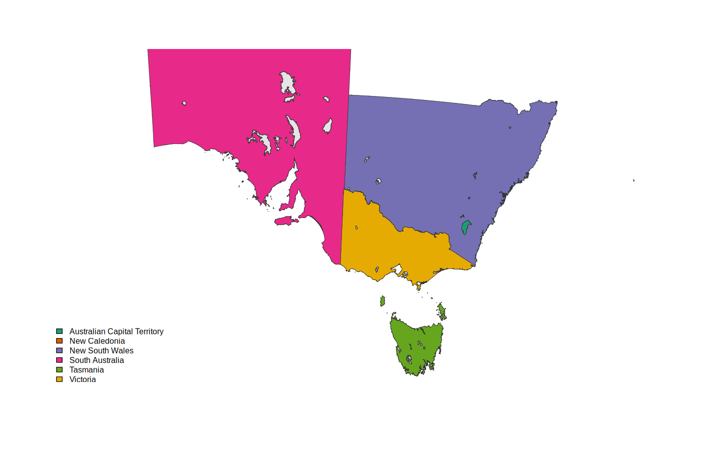

# Real-world data into the meshers

A guide to getting geometry from the outside world into cdtr, laridae,
trowel or RTriangle, and getting meshes back out, with example interfaces
you can `source()`. Nothing here is a package. The functions live in
[`mesh-wk.R`](mesh-wk.R) and the worked example is
[`inlandwaters.R`](inlandwaters.R) (run it from the repo root).

```r
source("guide/mesh-wk.R")
p <- pslg_from_wk(my_layer)          # anything wk can handle
m <- tri_mesh(p, "cdtr", max_area = area_for(p, 5e4), min_angle = 20)
lab <- tri_label(m)                  # which feature covers each triangle
out <- tri_as_wk(m, lab)             # triangles as wkb, labels alongside
```

## The pipeline

```
handleable --pslg_from_wk()--> pslg --tri_mesh(backend)--> tri --tri_as_wk()--> wkb
                                 |                           |
                           pslg_split()            tri_faces(), tri_label()
```

There are three objects, all plain lists of data frames, so nothing ties
them to one mesher.

**pslg** is the input contract the three packages already share, plus the
provenance a real layer carries:

| table | columns | one row per |
|---|---|---|
| vertices | x, y, (z, m), attribute columns | distinct (x, y) |
| segments | s0, s1, path, edge | input segment, as the geometry gave it |
| edges | e0, e1, count | distinct undirected edge |
| paths | path, feature, part, ring, role, n | ring, linestring or point |
| features | feature, the layer's other columns | input feature |

**tri** is the mesh, the same shape whichever backend made it: vertices
(with `origin`), triangles (v0, v1, v2, depth), `constraint` (mesh edges
lying on input edges), plus backend, crs, time and the pslg it came from.

**labels** (`tri_label()`) is the triangle table with `face`, `feature`
and the feature's columns joined on.

## Getting geometry in: anything wk handles

`pslg_from_wk()` takes a wk handleable or a data frame with one. That
covers most of what turns up:

| source | how |
|---|---|
| sf / sfc | directly, or `wk::as_wkb(x)` |
| GeoParquet | `t <- arrow::read_parquet(f); t$geometry <- wk::wkb(as.list(t$geometry))`, or geoarrow's own wk handler |
| GDAL via vapour / gdalraster | they return lists of raw WKB: `wk::wkb(vapour::vapour_read_geometry(dsn))` |
| geos, s2, terra (via `wk::wkb(terra::geom(v, wkb = TRUE))`) | directly |
| WKT text, wk::xy points | directly |

The example uses `silicate::inlandwaters` (six state polygons with lakes cut
out, in a Lambert conformal projection) as a data frame with a wkb column,
which is exactly what a GeoParquet file gives you:

```r
iw <- data.frame(ID = inlandwaters$ID, Province = inlandwaters$Province,
                 geometry = wk::as_wkb(inlandwaters))
p <- pslg_from_wk(iw)
#> <pslg> 30835 vertices, 33455 segments (30843 distinct edges, 2612 shared), 189 paths, 6 features
#>   roles: hole 32, shell 157
```

How the reader works, and the choices it makes:

1. **Everything goes through `wk::wk_coords()`**, which gives feature, part,
   ring and coordinates for any geometry type. A run of rows with the same
   (feature, part, ring) is a *path*: silicate's path identity, kept as a
   table, so every segment knows which ring of which feature it came from.
2. **Rings lose their closing coordinate** and get a closing segment back.
   The first ring of each polygon part is the shell, the rest are holes.
   Ring orientation is not trusted or needed.
3. **Vertices are deduplicated by exact (x, y)**, with `snap = ` to round to
   a grid first. Real layers have near-coincident vertices on shared
   boundaries that should be one vertex; exact is the default because
   snapping moves data. Z and M are kept (first value seen wins).
4. **Segments and edges are both kept.** `segments` is every input segment;
   `edges` is the distinct undirected edges with a `count`. Inlandwaters has
   2612 edges given twice: the Murray (NSW and Victoria), the
   NSW/Victoria/SA borders, and the ACT, whose outline is also a hole in
   NSW.
5. **Attributes**: the layer's columns go to `features` (they belong to
   faces, not vertices, so they are joined back after meshing, never
   interpolated). Per-vertex values (an elevation, a measured field) come in
   with `attr = function(v) data.frame(...)` and are interpolated by the
   backend onto every vertex it adds.

## Meshing: one call, any backend

`tri_mesh(p, backend, max_area, min_angle, max_steiner, boundaries, region)`
hands the same tables to whichever backend you name and reads the result
back into the common shape. Two arguments are worth explaining:

* **`boundaries = "unique"`** (default) feeds every distinct edge once, so a
  shared boundary is one constraint and every backend agrees on depth.
  `"as_given"` feeds every input segment, so a doubled boundary arrives
  twice. On inlandwaters laridae and cdtr then report depth 3 on the 279
  ACT triangles (two crossings for the shared outline) while trowel stays
  at 2. Which of those depth should mean is still an open decision (see the
  harness results); this argument only makes the feeding explicit.
* **`region = "inside"`** keeps triangles inside some constraint;
  `"hull"` keeps the convex hull (linework, points).

`max_area` is in CRS units squared, so the data needs a sensible planar
projection first; degrees squared is not an area. `area_for(p, n)` gives the
`max_area` that yields about n triangles over the polygon area.

Inlandwaters, refined to `area_for(p, 5e4)` and 20 degrees, on one machine:

| backend | vertices | triangles | depth 1 / 2 | seconds |
|---|---|---|---|---|
| cdtr | 101163 | 179434 | 158036 / 21398 | 0.74 |
| laridae | 100187 | 177648 | 155950 / 21698 | 0.96 |
| trowel | 117525 | 206118 | 184274 / 21844 | 2.85 |
| RTriangle | 93676 | 166071 | (none) | 0.35 |

Constrained only, all four give the same 42026 triangles in 0.08 to 0.12 s.

## Getting meaning back: faces, not depth

Depth does not tell you which feature a triangle belongs to. In
inlandwaters, depth 2 is both NSW's lakes (holes, belong to nothing) and
the ACT (a polygon sitting in a hole of NSW):

```
     labelled
depth  FALSE   TRUE
    1      0 158036
    2  20551    847
```



So labelling is done topologically, with one geometric test per face:

* `tri_faces(m)` splits the triangles into **faces**: maximal sets
  connected without crossing a constraint edge. Every triangle in a face is
  covered by the same set of input features. Inlandwaters has 190 faces
  for 179434 triangles.
* `tri_features(m)` takes one interior point per face and counts crossings
  against each feature's own rings (even-odd per feature). A face covered
  by nothing is absent; overlapping features give several rows. It never
  consults depth, so it works the same for coverages, holes, overlaps and
  multipolygons, and for every backend including RTriangle.
* `tri_label(m)` joins faces, features and the layer's columns onto the
  triangle table.

Areas per feature from the labelled mesh reproduce the input exactly, for
all six states.



## Getting it out again

* `tri_as_wk(m, labels)`: one wkb polygon per triangle, with the label
  columns alongside, so any wk consumer (sf, geoarrow, a GDAL writer) takes
  it from there.
* `tri_edges_wk(m)`: mesh edges as linestrings, `constraint = TRUE` on the
  ones lying on input boundaries.
* `tri_interpolate(m, x, y)`: the vertex attributes at query points, linear
  within the containing triangle. A linear field `f = x + 2y` comes back to
  5e-8 on a coordinate scale of 1e6.

## Splitting big layers

Features that share no boundary can be meshed independently:
`pslg_split(p, by)` returns one pslg per group, ready for `lapply` or a
parallel map. Shared boundaries must stay in one group or the two sides
refine differently and the mesh does not conform; for inlandwaters that
means NSW, Victoria, SA and the ACT together, Tasmania and New Caledonia on
their own. The `edges$count` and `paths` tables are what tell you which
features touch.

## What this suggests for the packages

These are proposals, not things any package does yet.

1. **A wk reader for the contract.** `pslg_from_wk()` is backend-neutral and
   about 80 lines; it belongs once, upstream of all the meshers (silicate,
   or a small package of its own), not in each one.
2. **Faces from the backend.** All three meshers already hold triangle
   adjacency and know which edges are constrained. Returning a face id per
   triangle would make labelling free; in R it costs 1.4 s on 179k
   triangles.
3. **Constraint edge to input segment.** laridae's `segments` table already
   maps every constraint edge to the input segment (and so the path and
   feature) it came from. With that from every backend, labels could follow
   from one side of one edge instead of a crossing test.
4. **Feed per path, not per segment.** A path id on each segment is the
   per-tag depth idea: depth per feature falls out, and the "k crossings or
   1" question becomes "count per tag".
5. **Streaming large layers.** Reading GeoParquet in row groups through
   geoarrow, splitting by touching groups, and meshing per group is the
   route to layers too big for one call.

## Known gaps in the example code

* GEOMETRYCOLLECTION is read but every path is treated as a line or point
  (roles are only assigned to polygon types).
* `pslg_split()` drops point-only features (a pslg does not keep which
  vertices lone points used).
* `snap` is a grid round, not a tolerance merge, and nothing checks
  validity: crossing rings are resolved by the meshers (they insert the
  crossing), and even-odd per feature then defines membership.
* `tri_interpolate()` is brute force with no spatial index; fine for
  thousands of points.
